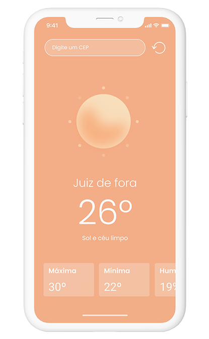
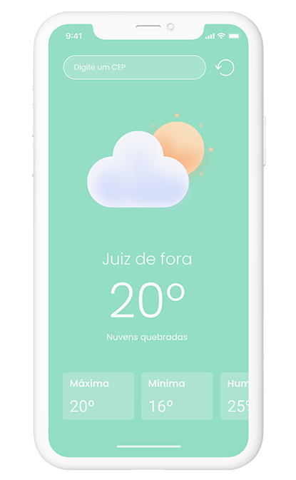
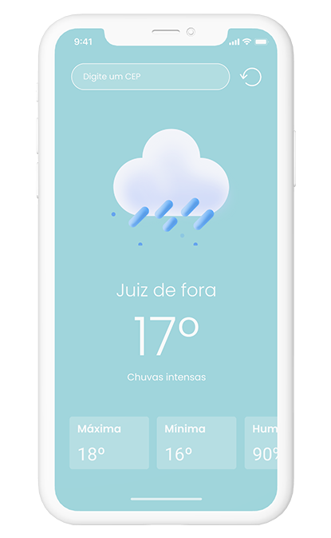
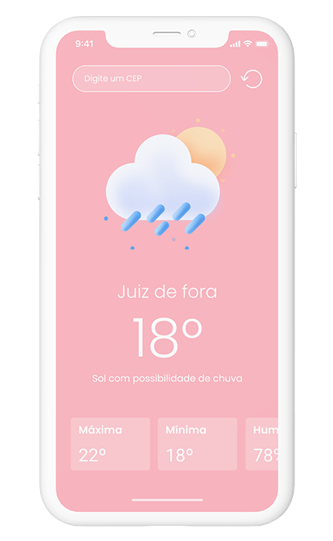

[](https://github.com/mateuslouback/WeatherApp/stargazers)
[](https://github.com/mateuslouback/WeatherApp/issues)
[](https://github.com/mateuslouback/WeatherApp/network)

<br />
<p align="center">
  


  <h2 align="center">Weather App</h2>

  <p align="center">
    <strong>Sample application that seeks weather forecasts for cities worldwide.</strong>
    <br />
  </p>


## Contents

* [About the Project](#about-the-project)
  * [Built With](#built-with)
* [Getting Started](#getting-started)
  * [Installation](#installation)
* [Screenshots](#screenshots)
* [Application tests](#application-tests)
* [Contact](#contact)


## About The Project

<p align="center">
  
</p>

This is a weather forecast project for cities around the world.
The project was made for the IOS and Android platforms through React Native with Expo.
<br />
<br />


### Built With

* [React-Native](https://github.com/facebook/react-native)
* [Expo](https://expo.io)
* [Expo Location](https://docs.expo.io/versions/v38.0.0/sdk/location/)
* [Styled Components](https://styled-components.com)


## Getting Started

To get a local copy up and running follow these simple steps.


### Installation

1. Create account in [Open Weather](https://openweathermap.org) to obtain the access API_ID.

2. Instal [Expo CLI](https://expo.io/learn)
```sh
npm install expo-cli --global
```
3. Clone the repo:
```sh
git clone https://github.com/mateuslouback/WeatherApp.git
```
4. Install the packages into the main project folder:
```sh
yarn install
```
or
```sh
npm install
```
5. Create an .env file and put the API token obtained from the file in place of your_token in the API_TOKEN property
```sh
API_TOKEN = "token_obtained"
```
6. Run project on IOS or Android:
```sh
yarn start
```
or
```sh
npm start
```
7. Read the QRCode with your cell phone camera or press "i" on the terminal to open the application in the iPhone emulator or press "a" to open the Android emulator.

## Application tests

1. Run the following script in the terminal to run the tests:
```sh
yarn test
```
2. Run the following script in the terminal to view the test report in the WeatherApp/coverage/lcov-report/index.html path:
```sh
yarn test --coverage
```

## Conventional Commits
In the project, conventional commits was used to type all commits.
[Click here](https://github.com/facebook/react-native) to learn more about conventional commits.

## Screenshots

<p align="center">
  
  
  
  
</p>


## Contact

[Mateus Louback](https://mateuslouback.github.io) - [LinkedIn](https://www.linkedin.com/in/mateuslouback/)
